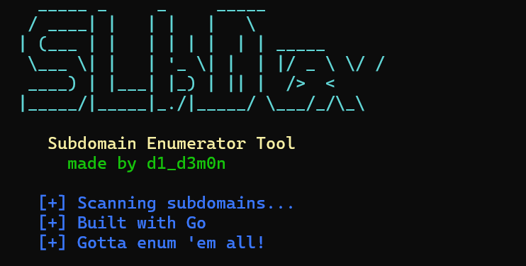

# 🕵️ Subdomain Enumerator

A fast and efficient multithreaded subdomain enumeration tool written in Go. It uses custom wordlists to enumerate subdomains for a given target domain using DNS queries.


---

## 🚀 Features

- ✅ Uses custom DNS resolvers (default: `8.8.8.8`)
- ✅ Multithreaded (concurrent workers)
- ✅ Supports CNAME resolution
- ✅ Outputs results to `.csv` file
- ✅ Pretty console output
- ✅ 🐳 Docker-ready!

---


## Tech Stack

**Server:** Golang

## 📸 Demo


## Installation

Install my-project with npm

```bash
  git clone https://github.com/d1_d3m0n/subdex.git
  cd subdex
  go build -o subenum
  ./subenum -domain example.com -wordlist subdomains.txt -c 200
```

## Screenshots




## Example Output
```bash
  Output saved as: example.com.csv
  www.example.com    93.184.216.34
  blog.example.com   192.0.2.10
  cdn.example.com    203.0.113.5
```

## Docker Support
  ```bash
  docker build -t subdex .
```
 ## Run the Tool Using Docker
 ```bash
  docker run --rm -v $(pwd):/data subenum \
  -domain example.com -wordlist /data/wordlist.txt -c 100
```
📁 Results will be saved to /data/example.com.csv in your current directory.


## 🧠 Lessons Learned

While building this project, I gained hands-on experience in several key areas of Go development:

📡 Performing DNS Queries in Go
Learned how to use the miekg/dns library to craft raw DNS queries.

Understood how to query both A records and CNAME records.
👷 Using Workers in Go
Implemented the worker pool pattern to efficiently distribute DNS resolution tasks.
Used sync.WaitGroup to coordinate and gracefully shut down all workers after job completion.

🔄 Mastering Concurrency
Practiced writing safe, concurrent code using goroutines and channels.

🧪 Additionally, I learned how to write basic unit tests in Go and structure testable functions around network behavior.

## Author
```bash
  Made with ❤️ by d1_d3m0n
```

## 🔒 Disclaimer
This tool is intended for educational and authorized security testing purposes only. Unauthorized scanning or probing of networks you don't own is illegal and unethical.

## 📜 License

MIT License. © 2025 d1_d3m0n
